# 👁️ GlaucomaVision: Unified Vision Testing & AI-Based Early Glaucoma Detection

**GlaucomaVision** is a modular, web-based platform designed to detect **early-stage glaucoma** by integrating **seven standardized vision tests**, doctor inputs, and deep learning analysis — all in a **scalable, multilingual environment**.

Glaucoma often remains undiagnosed until 50–60% vision loss has occurred. This platform bridges that gap by combining **functional vision testing**, **clinical context**, and **AI-based risk stratification** — helping detect issues much earlier, in a more personalized way.

> 🔐 **Note**:  
> The full source code, model pipeline, and test configuration are hosted in a **private repository**  
> 🔗 **[github.com/SofiaRebecca/Glau.git](https://github.com/SofiaRebecca/Glau.git)**  
> Access is **restricted for confidentiality** due to the use of:
> - Doctor-supplied patient input data
> - Protected test methodologies
> - Research-stage CNN model architecture and training data

---

## 🌟 Why This Is Needed

- 🔍 **Late diagnosis is common** — traditional tests detect only after major damage
- 🧪 **Fragmented testing** — vision function tests are scattered across devices and systems
- ⚠️ **Lack of personalization** — few systems combine symptoms + lifestyle factors
- 💰 **High cost barriers** — existing test devices are expensive and inaccessible to rural clinics

---

## ✨ Unique Selling Points

| 🚀 Feature | ✅ What It Does |
|-----------|----------------|
| 🧠 **All-in-One Platform** | Integrates **7 vision tests**: Pelli-Robson, CSV-1000, SPARCS, 24-2 Humphrey, Motion, Edge, Pattern |
| 👨‍⚕️ **Doctor Integration** | Post-test **symptoms & lifestyle inputs** (e.g., screen time, eye strain) directly from clinicians |
| 🧩 **Modular Microservices** | Each test runs independently on ports `8000–8007` (Flask) |
| 🌐 **Multilingual Support** | Full **English and Kannada interfaces** for accessibility |
| 🖥️ **Doctor ↔ Patient Views** | Real-time **screen mirroring** using WebSocket.io |
| 📊 **CNN-Based Prognostics** | Multi-branch CNN analyzes visual + metadata for **early-stage detection** |
| 📱 **Device & VR Compatibility** | Mobile-ready and **VR-compatible** for distraction-free testing |
| 📁 **Local Data Logging** | Structured Excel output of test results and clinician notes |
| 🔒 **Privacy First** | Research-protected data and private repo for clinical confidentiality |

---

## 🖼️ UI and Test Screenshots

Images are included in the private repository under the `images/` folder. Here’s what’s available:

### 👥 System Navigation

- ✅ Doctor and Patient Index Page  
  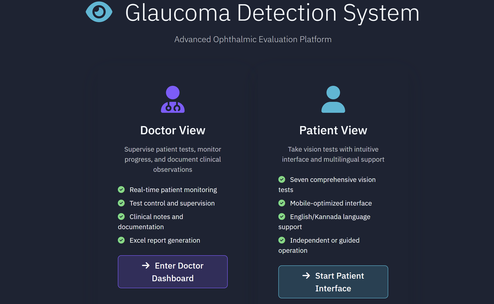

- ✅ Test Selection Page  
  

- ✅ Test Completion Summary  
  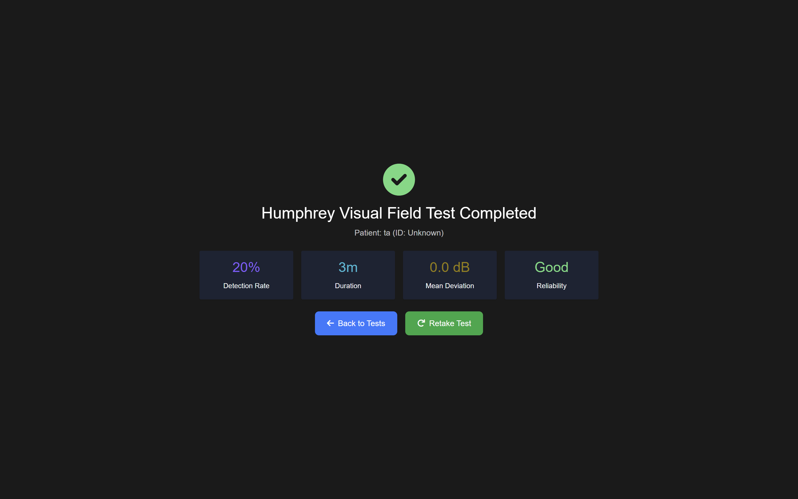

- ✅ Doctor Dashboard with Live Patient Mirroring  
  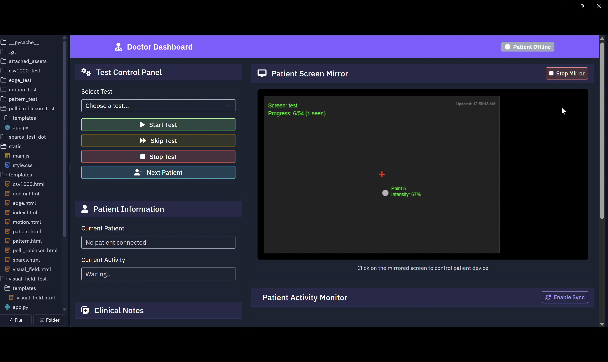

---

### 🧪 Vision Tests – Sample UIs (English & Kannada)

| Test | English UI | Kannada UI |
|------|------------|------------|
| **Pelli-Robson**      | 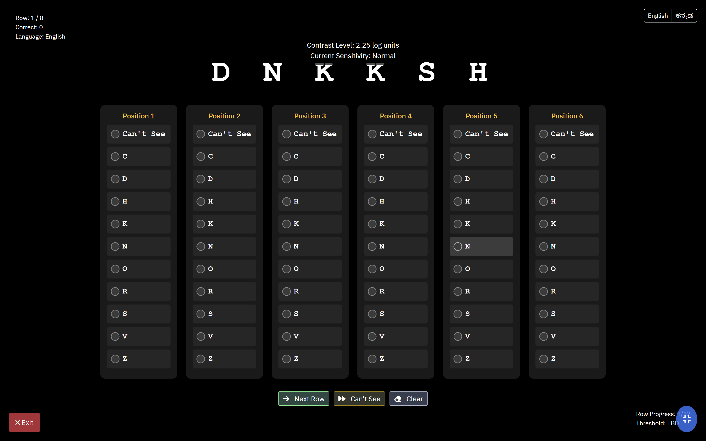 | 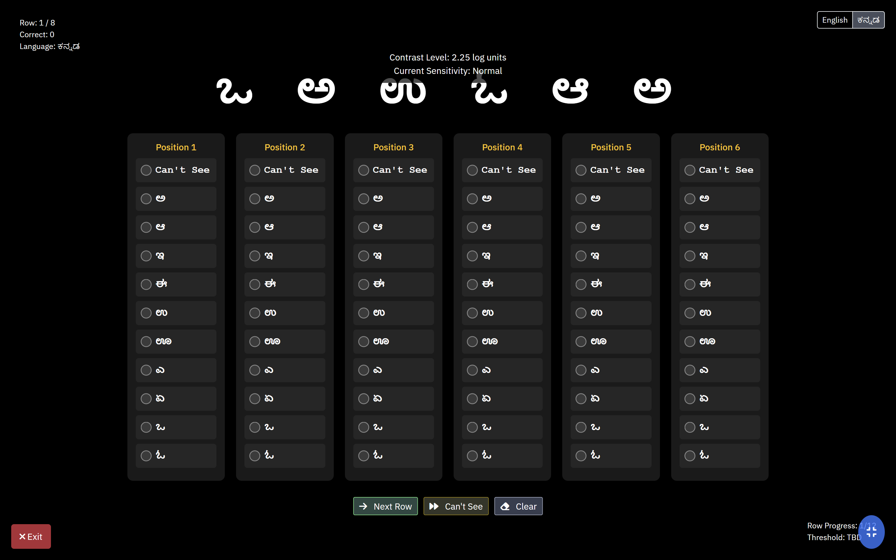 |
| **CSV-1000**          | 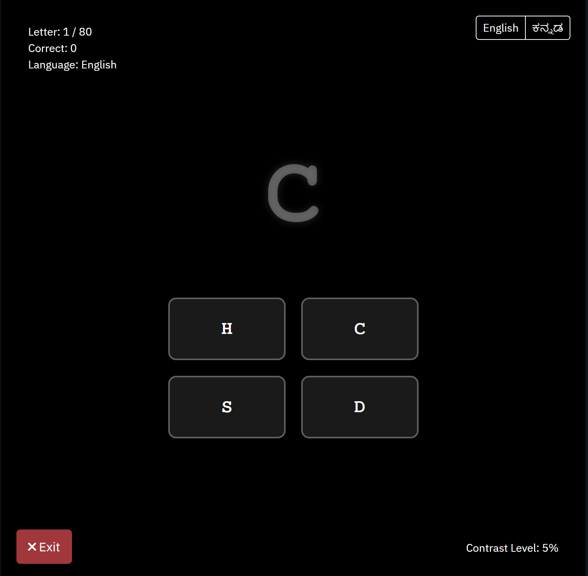     | 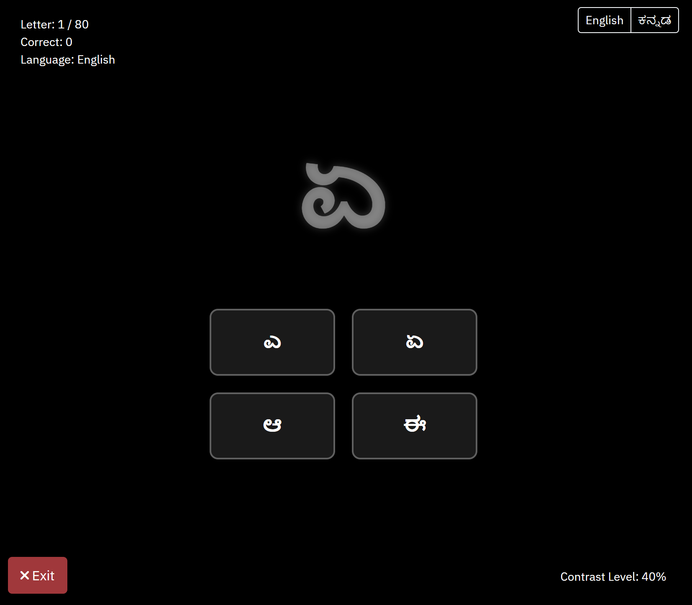     |
| **SPARCS**            |           | — |
| **24-2 Humphrey**     | 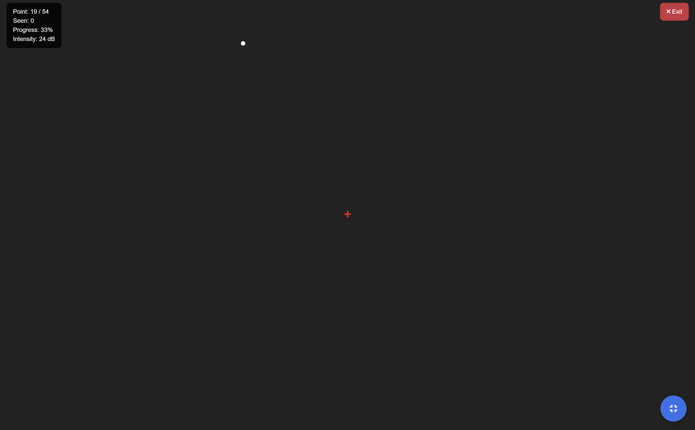      | — |
| **Motion Detection**  | 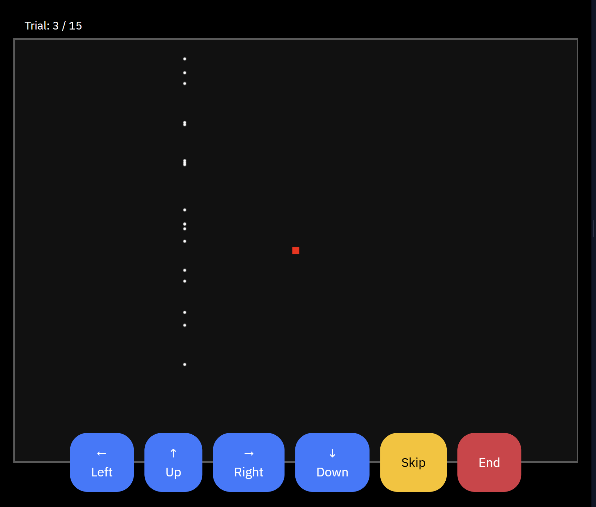          | — |
| **Edge Detection**    | 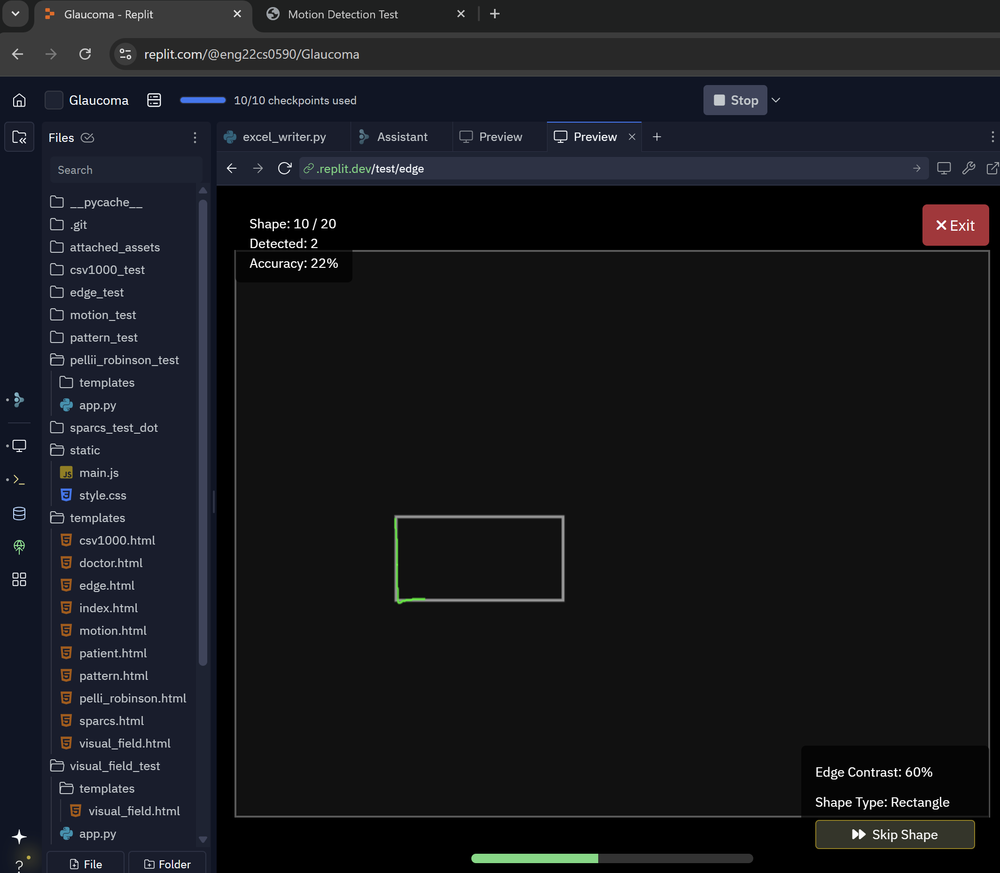              | — |
| **Pattern Detection** | 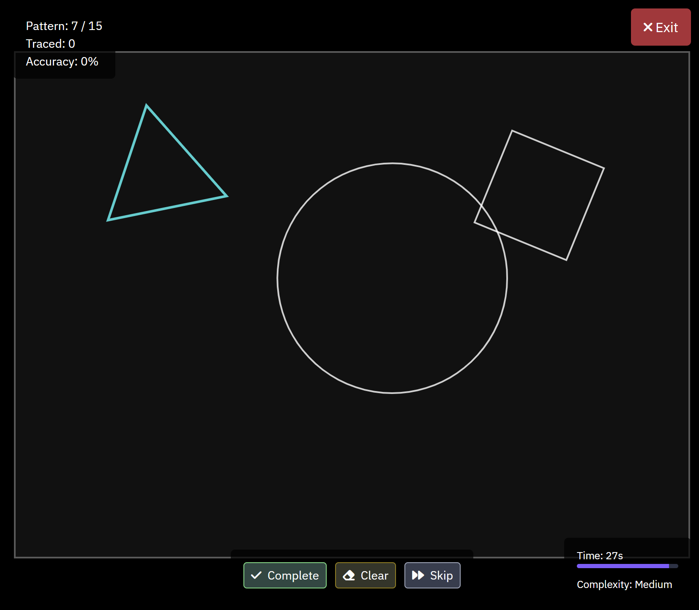        | — |

---

## 🧠 CNN-Based Glaucoma Detection Pipeline

The vision test results and doctor inputs are processed and fed into a **multi-branch Convolutional Neural Network (CNN)** for diagnosis. Here's how the system flows:

```plaintext
         +----------------+
         |  Vision Tests  |
         |----------------|
         | - Pelli-Robson |
         | - CSV-1000     |
         | - SPARCS       |
         | - Humphrey 24-2|
         | - Motion       |
         | - Edge         |
         | - Pattern      |
         +----------------+
                |
                v
      +-----------------------+
      | Raw Data Collection   |
      |-----------------------|
      | Response Time         |
      | Accuracy/Deviation    |
      | Doctor Inputs         |
      +-----------------------+
                |
                v
      +-----------------------+
      |  Data Preprocessing   |
      |-----------------------|
      | Normalization         |
      | Augmentation          |
      | Feature Vectorization |
      +-----------------------+
                |
                v
      +---------------------------+
      |  Multi-Branch CNN Model  |
      |---------------------------|
      | Branch 1: Contrast        |
      | Branch 2: Motion          |
      | Branch 3: Tracing Deviation|
      +---------------------------+
                |
                v
        +---------------------+
        | Classification:     |
        |---------------------|
        | Normal              |
        | Mild Deficit        |
        | Severe Deficit      |
        +---------------------+
```
---

## 🎥 Demo – Test Workflow Overview

Watch the full platform in action: patient login, test flow, doctor mirroring, and classification output.
> ℹ️ For high-quality video, [click here to view the full demo](demo.mp4)

---

📫 Contact
🧑‍💻 Developed by Sofia Rebecca
📬 sofia.beckah@gmail.com
🔗 https://www.linkedin.com/in/sofia-rebecca-830475280

